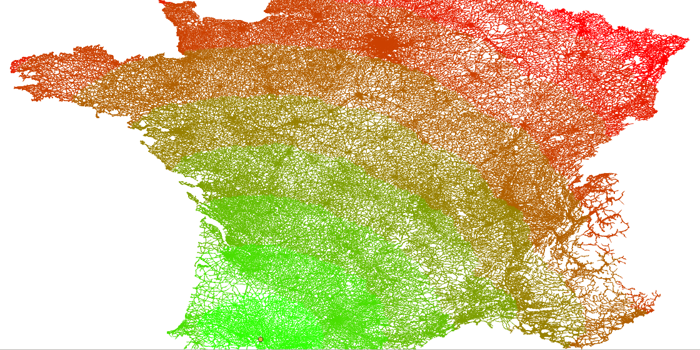

# graph-experiments

## Description

Graph processing experiments based on **boost::graph** and **GDAL / OGR** to load data (2020).

## Motivation

**This project is not maintained.** It has been created in 2019 to prepare work about tour planning at [IGNF](https://github.com/IGNF).

## Key Features

* [src/egraph/routing/PathTree.h](src/egraph/routing/PathTree.h) is using [Boost Multi-Index](https://www.boost.org/doc/libs/1_63_0/libs/multi_index/doc/index.html) to index `(visited,cost)` to optimize **Dijkstra path finding**.
* [src/egraph/FeatureGraph.h](src/egraph/FeatureGraph.h) is providing a [Boost graph](https://www.boost.org/doc/libs/1_75_0/libs/graph/doc/index.html) where vertex and edges are [OGRFeature](https://gdal.org/doxygen/classOGRFeature.html) from [GDAL](https://gdal.org/doxygen/index.html)


## Build

* [CMake - Building on debian or ubuntu](docs/build-debian.md)
* [CMake - Building with docker](docs/build-docker.md)
* [CMake - Building on windows with Microsoft Visual Studio (nmake) and miniconda](docs/build-windows.md)

## Examples

* [example/demo-boost.cpp](example/demo-boost.cpp) : Getting started with `boost::graph`
* [example/demo-dijkstra.cpp](example/demo-dijkstra.cpp) : Shortest path computation
* [example/demo-ogr.cpp](example/demo-ogr.cpp) : Load `FeatureGraph` using GDAL/OGR and compute some `ShortestPathTree`

```bash
example/demo-ogr "PG:dbname=gis" "graph.vertex" "graph.edge"
# or
example/demo-ogr "PG:dbname=gis" "graph.vertex" "graph.edge_distance_weighted"
```



## Performance debug

```bash
valgrind --tool=callgrind example/demo-ogr 'PG:dbname=gis' 'graph.vertex' 'graph.edge_distance_weighted'
kcachegrind $(ls -tr callgrind.out.* | tail -1)
```

## License

[MIT](LICENSE)
